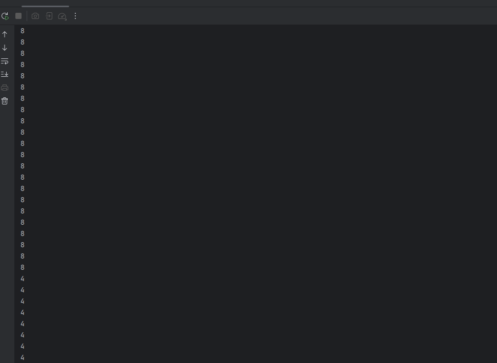
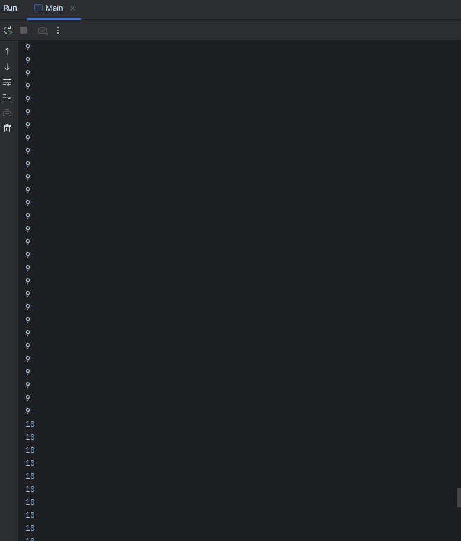

# Exercices de Programmation Multi-Threads en Java

Ce dépôt contient des solutions aux exercices pratiques axés sur la programmation multi-threads et parallèle en Java. Ces exercices font partie du cours de Programmation Orientée Objet en Java dirigé par M. Abdelmajid Bousselham.

## Aperçu des Exercices

### Exercice 1 : Multi-Threading avec `Runnable`

- **Objectif** : Créer une application simple pour démontrer un comportement classique de multi-threading.
- **Étapes** :
  1. Implémenter la classe `Talkative` avec un attribut entier.
  2. Modifier `Talkative` pour implémenter l'interface `Runnable`.
  3. Redéfinir la méthode `run` pour afficher 100 fois la valeur de l'attribut.
  4. Dans la méthode `main`, créer 10 instances de `Thread`, chacune avec une instance unique de `Talkative`.
  5. Démarrer chaque thread et observer la sortie.
- **Résultat Attendu** : L'application montre une exécution concurrente avec chaque thread affichant sa valeur d'attribut respective.
- **Execution**: <br><br>
    
    
<h4>
 <hr>
  6.Que constatez-vous ?
  <br><br>
   En exécutant ce programme, je constate que les messages s'affichent de manière désordonnée. Chaque thread exécute sa propre méthode run, et c'est le système qui détermine l'ordre d'exécution.  Cela provoque un affichage entrelacé des valeurs, car les threads s'exécutent en parallèle, et les sorties peuvent se mélanger en fonction de la gestion des ressources processeur.
</h4>
 <hr>
 <br>
<br>
### Exercice 2 : Calcul de la Somme en Parallèle avec un Pool de Threads

- **Objectif** : Utiliser un pool de threads pour calculer la somme des éléments d'un tableau en parallèle.
- **Étapes** :
  1. Implémenter la classe `Sommeur` qui calcule la somme sur une plage d'indices dans un tableau.
  2. Fournir une méthode `getSomme` pour retourner la somme calculée.
  3. Dans la classe `main`, diviser le tableau en plages, créer un pool de threads, et attribuer chaque plage à une instance de `Sommeur`.
  4. Attendre que tous les threads se terminent et afficher la somme totale.
- **Résultat Attendu** : Le programme montre un calcul parallèle efficace de la somme du tableau à l'aide de pools de threads.
- **Execution**: <br><br>
    
   
## Comment Exécuter

1. Cloner le dépôt :
   ```bash
   git clone https://github.com/ouss-issib/practical-activity-threads.git

2. Naviguer dans le répertoire du dépôt :
   ```bash
   cd java-threading-exercises

3. Compiler et exécuter les fichiers Java :
   ```bash
   javac *.java
   java Main


